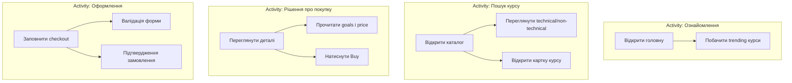

# Протокол лабораторної роботи №1
## Формалізація бізнес-вимог. Планування інкременту. Acceptance criteria. Тест-кейси

**Продукт:** IT Courses Platform — веб-платформа для перегляду та замовлення IT-курсів.  
**Студент:** _[ПІБ]_  
**Дата:** 19.05.2026

---

## 1. Опис продукту з точки зору користувача

IT Courses — це сайт, де відвідувач може:
- переглянути популярні курси на головній сторінці;
- відкрити каталог і обрати курс за категорією (technical / non-technical);
- переглянути деталі курсу (ціна, тривалість, цілі, опис);
- оформити замовлення через форму checkout (email, телефон, назва курсу, номер картки);
- отримати підтвердження на сторінці «Thank you».

Дані курсів надходять з REST API (json-server на порту 3001), серверна частина (Express) віддає HTML-сторінки через EJS.

---

## 2. Lean Canvas (додатково, +2 бали)

| Блок | Зміст |
|------|--------|
| **Problem** | Важко знайти структуровану інформацію про IT-курси в одному місці; немає простого онлайн-запису |
| **Customer Segments** | Студенти, кар'єрні switchers, junior-розробники в Україні |
| **Unique Value Proposition** | Каталог перевірених IT-курсів з прозорою ціною та швидким записом |
| **Solution** | Веб-каталог + сторінка курсу + checkout без реєстрації |
| **Channels** | SEO, соцмережі, партнерські школи |
| **Revenue Streams** | Комісія з продажу курсів / реклама партнерів |
| **Cost Structure** | Хостинг, API, підтримка контенту |
| **Key Metrics** | Конверсія catalog → checkout, час до оформлення замовлення |
| **Unfair Advantage** | Інтеграція з локальними IT-школами, schema.org для SEO |
| **Early Adopters** | Студенти KPI та випускники bootcamp |

---

## 3. User Story Map

### Користувачі та цілі

| User | User Goal |
|------|-----------|
| Відвідувач (Guest) | Знайти відповідний курс і записатися |
| Потенційний студент | Порівняти курси за ціною та напрямком |

### Activities → Steps → Tasks (пріоритет зверху вниз)

### Інкременти (релізи)

| Інкремент | User Tasks | Опис |
|-----------|------------|------|
| **Інкремент 1 (MVP)** | T1, T2, T3, T4 | Головна, каталог, деталі курсу без оплати |
| **Інкремент 2** | T5, T6, T7 | Buy → Checkout → Thank you + POST /orders |

*Діаграму для звіту можна намалювати в [Excalidraw](https://excalidraw.com/) або [diagrams.net](https://app.diagrams.net/) за цією структурою.*

---

## 4. П'ять User Stories з Acceptance Criteria

### US-01: Перегляд trending курсів на головній

**As a** visitor **I want** to see trending courses on the home page **so that** I can quickly discover popular programs.

**Acceptance criteria:**
- AC1: На `/` відображаються картки курсів після завантаження API.
- AC2: Мінімум 1 курс з переліку QA engineer, UI/UX designer, Data Analyst.
- AC3: При помилці API показується зрозуміле повідомлення, сторінка не «падає».

---

### US-02: Перегляд каталогу за категоріями

**As a** visitor **I want** to browse courses grouped by technical and non-technical categories **so that** I can find courses matching my profile.

**Acceptance criteria:**
- AC1: Сторінка `/catalog` містить дві секції: Technical та Non-technical.
- AC2: Кожна картка показує title, rating (зірки), duration.
- AC3: Клік по картці веде на `/course/:id`.

---

### US-03: Перегляд деталей курсу

**As a** visitor **I want** to view full course details **so that** I can decide whether to enroll.

**Acceptance criteria:**
- AC1: URL `/course/:id` з числовим id показує title, price, sessions, goals, description.
- AC2: Нечисловий id повертає HTTP 400 «Invalid course id».
- AC3: Кнопка «Buy» присутня на сторінці.

---

### US-04: Оформлення замовлення (checkout)

**As a** prospective student **I want** to submit my contact and payment details **so that** I can enroll in a course.

**Acceptance criteria:**
- AC1: Форма вимагає email (pattern), phone (10–15 цифр), course name, card (13–19 цифр).
- AC2: При невалідних полях показуються повідомлення під полем.
- AC3: Успішний submit створює order через API і редіректить на `/thank-you`.

---

### US-05: Захист від некоректного id курсу

**As a** system **I want** to reject malformed course IDs in the URL **so that** injection attacks via path parameters are prevented.

**Acceptance criteria:**
- AC1: `GET /course/abc` → 400.
- AC2: `GET /course/1;DROP TABLE` → 400.
- AC3: `GET /course/1` → 200.

---

## 5. Функціональні тест-кейси (пріоритет: P1 — критичний, P2 — високий)

### TC-US01-01 (P1)

| Поле | Значення |
|------|----------|
| **Test case ID** | TC-US01-01 |
| **Description** | Trending courses відображаються на головній |
| **Prerequisites** | json-server запущено на :3001, Express на :3000 |
| **Test steps** | 1. Відкрити `http://localhost:3000/` 2. Дочекатися завантаження JS |
| **Test data** | db.json містить курси QA engineer, UI/UX designer, Data Analyst |
| **Expected Result** | Видно ≥1 `.course-card` у блоці trending |
| **Actual Result** | _Not executed_ |
| **Status** | Not executed |
| **Created By** | _[ПІБ]_ |
| **Date of creation** | 19.05.2026 |
| **Executed By** | — |
| **Date of execution** | — |

### TC-US02-01 (P1)

| Поле | Значення |
|------|----------|
| **Test case ID** | TC-US02-01 |
| **Description** | Каталог показує курси в обох категоріях |
| **Prerequisites** | Сервери запущені |
| **Test steps** | 1. Відкрити `/catalog` 2. Перевірити `#technicalCourses` та `#nonTechnicalCourses` |
| **Test data** | ≥1 technical, ≥1 non-technical у db.json |
| **Expected Result** | У кожній секції є `.course-card` |
| **Actual Result** | _Not executed_ |
| **Status** | Not executed |
| **Created By** | _[ПІБ]_ |
| **Date of creation** | 19.05.2026 |

### TC-US03-01 (P1)

| Поле | Значення |
|------|----------|
| **Test case ID** | TC-US03-01 |
| **Description** | Валідний id курсу відкриває деталі |
| **Prerequisites** | Курс id=1 існує в API |
| **Test steps** | 1. Відкрити `/course/1` 2. Перевірити `#courseTitle` |
| **Test data** | id = 1 |
| **Expected Result** | Заголовок ≠ «Course Title» (підставлено з API) |
| **Actual Result** | _Not executed_ |
| **Status** | Not executed |

### TC-US03-02 (P2)

| Поле | Значення |
|------|----------|
| **Test case ID** | TC-US03-02 |
| **Description** | Невалідний id повертає 400 |
| **Prerequisites** | Express запущено |
| **Test steps** | 1. `GET /course/abc` |
| **Test data** | id = abc |
| **Expected Result** | HTTP 400, текст містить «Invalid course id» |
| **Actual Result** | _Automated in tests/integration/security.test.js_ |
| **Status** | Pass (автотест) |

### TC-US04-01 (P1)

| Поле | Значення |
|------|----------|
| **Test case ID** | TC-US04-01 |
| **Description** | Успішне оформлення замовлення |
| **Prerequisites** | json-server, Express; localStorage може містити selectedCourse |
| **Test steps** | 1. `/course/1` → Buy 2. Заповнити email, phone, courseName, cardNumber 3. Pay |
| **Test data** | email: test@example.com, phone: 0501234567, card: 4111111111111111 |
| **Expected Result** | Редірект на `/thank-you`, заголовок «Thank you» |
| **Actual Result** | _Not executed_ |
| **Status** | Not executed |

### TC-US04-02 (P2)

| Поле | Значення |
|------|----------|
| **Test case ID** | TC-US04-02 |
| **Description** | Валідація email при checkout |
| **Prerequisites** | Сторінка `/checkout` |
| **Test steps** | 1. Ввести email `invalid` 2. Blur / Submit |
| **Test data** | email = invalid |
| **Expected Result** | Помилка «Invalid format» біля поля email |
| **Actual Result** | _Not executed_ |
| **Status** | Not executed |

---

## 6. Чекліст інкременту 1 (MVP: перегляд без оплати)

| # | Перевірка | ✓ / ✗ |
|---|-----------|-------|
| 1 | Головна сторінка відкривається (200) | |
| 2 | Навігація Home / Catalog працює | |
| 3 | Каталог завантажує курси з API | |
| 4 | Technical і Non-technical секції заповнені | |
| 5 | Клік по картці → сторінка курсу | |
| 6 | Деталі курсу: title, price, goals, description | |
| 7 | Невалідний `/course/xxx` → помилка 400 | |
| 8 | Адаптивність (mobile / tablet / desktop) — візуально | |
| 9 | Семантичні теги header/nav/main присутні | |
| 10 | schema.org JSON-LD на catalog / course | |
| 11 | Немає критичних помилок у консолі браузера | |
| 12 | CSS завантажується (`/css/style.css`) | |

---

## Висновок

Продукт **IT Courses** повністю підходить для ЛР1: є зрозумілі user flows (каталог → деталі → checkout), їх можна розбити на 2 інкременти, сформувати 5+ user stories та тест-кейси. Частина критеріїв US-05 вже автоматизована в `tests/integration/security.test.js` (ЛР2).
